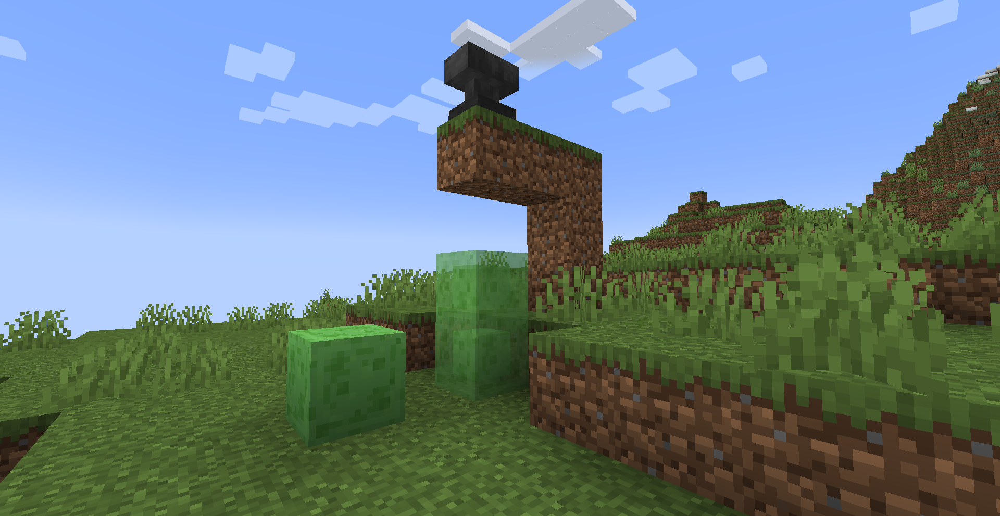
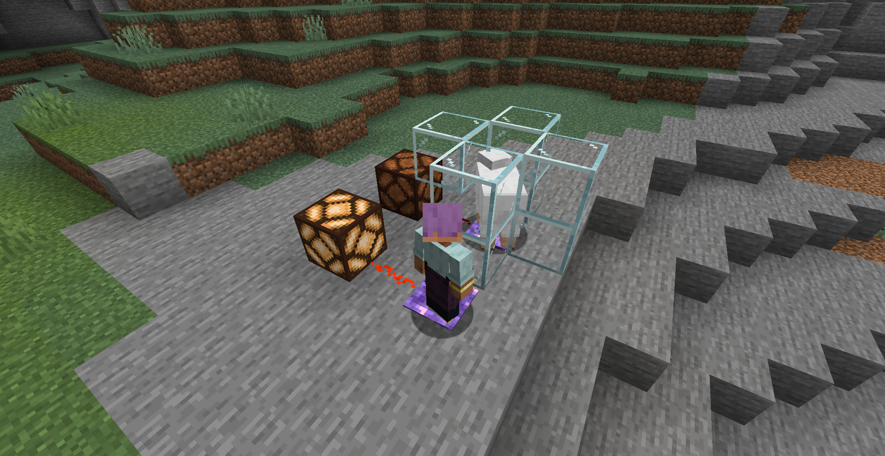

### 1. Compressed Slime Block

**The slime blocks bounce higher and higher. Use an iron anvil to smash them together to obtain two slime blocks.**

### 2. Amethyst Pressure Plate

**An amethyst pressure plate that can only be triggered by players and emits a signal strength of 15.**

